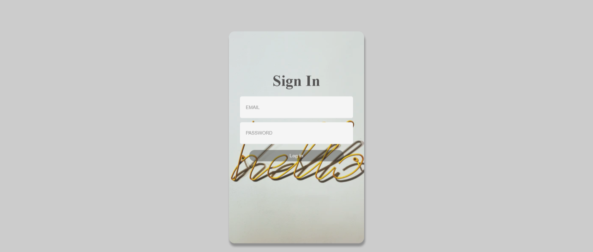
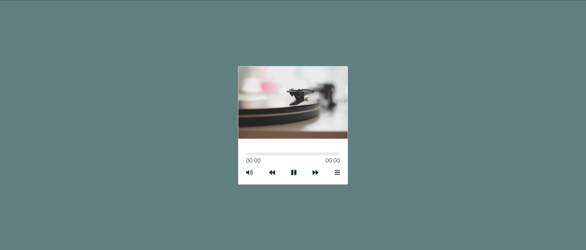
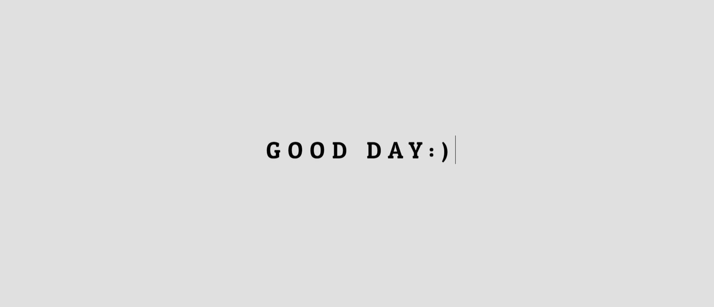
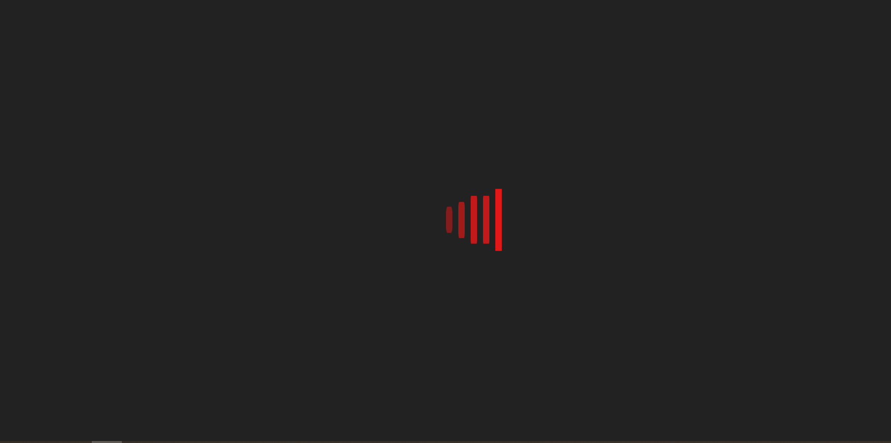
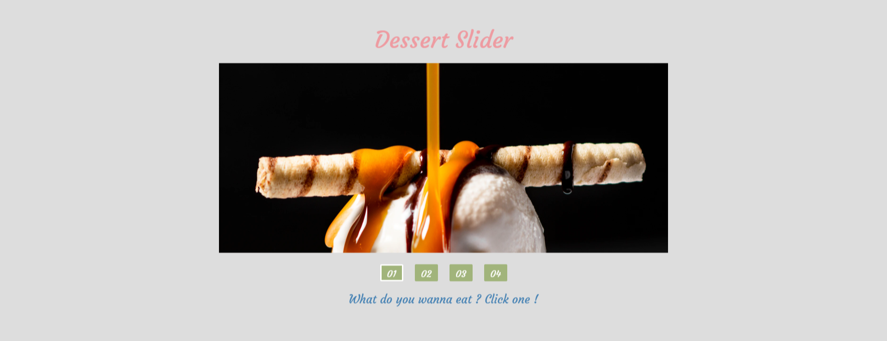
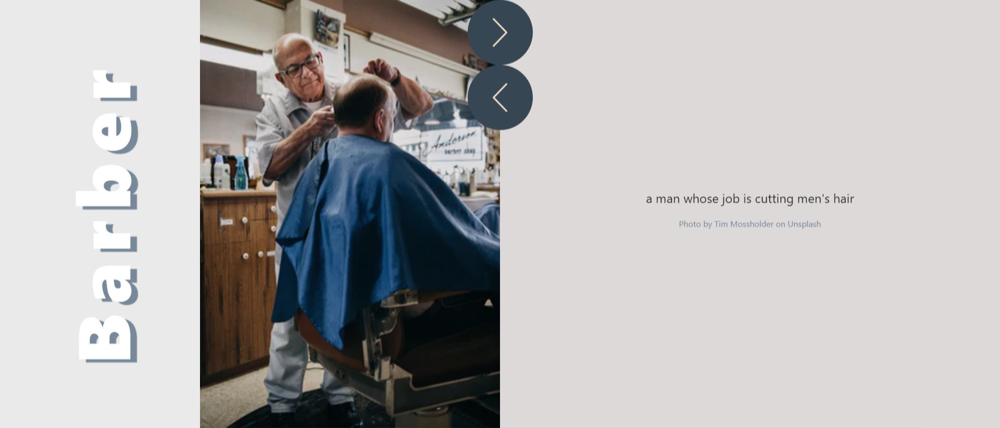
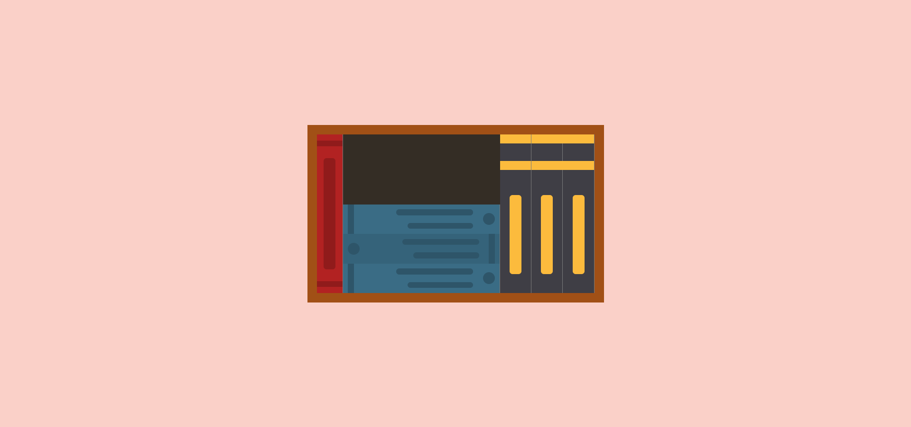
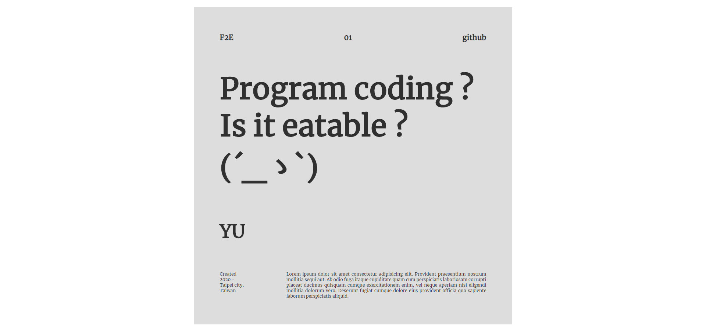
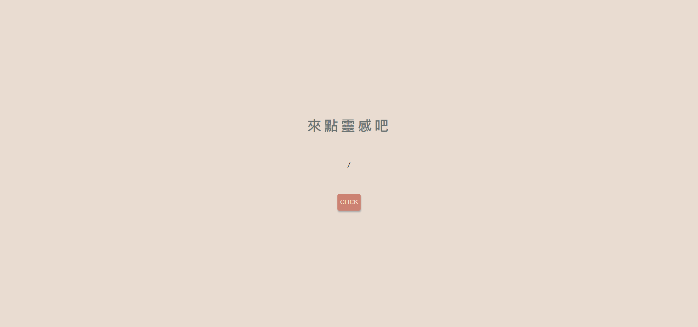

# Portfolio
### *HELLO THERE !  :-)*
> YOU can see how it works on [CodePen](https://codepen.io/YCH06)

## GUIDE

- **01. Sign in**
	> 
	
- **02. Music Player**
	> 

- **03. Weather Button**
	> 
	
- **04. GOOD DAY TYPING**
	> 
	
- **05. Sound Wave Loading**
	> 
	
- **06. Desert Slider**
	> 
	
- **08. Working People Fluid Carousel**
	> 
	
- **09. Scroll Effect**
	> 
	
- **10. Bookcase for flex practice**
	> 
	
- **11. Simple Info for flex practice**
	> 
		
- **12. Inspiration of Tag**
	> 

## MEMO
